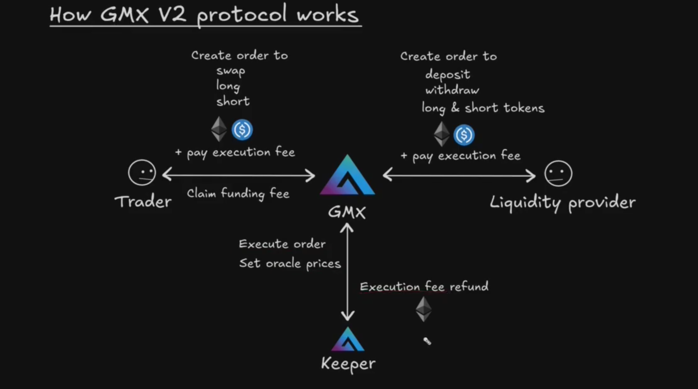

# Title: GMX v2 Research Paper

**Date:** 2026-08-05
**Author:** Emil Roydev
**Status:** In Progress
**Topic:** Blockchain DEFI

---

## Executive Summary

I research this as a reference point for kairos-dex implementation on Solana. My idea is to find how `GMX` handles their implementation, how they mitigate risks, what services they have and how everything is connected.

#### GMX
- Is a perpetual exchange. It allows traders to take short and long positions up to 100x leverage. It also allows traders to swap tokens at the market price or submit limit order. Of course they are liquidity providers that can earn tokens without being traders by providing liquidity to GM Pool or GLV Vault.

---

## Fundamentals of GMX

### GM Pool vs GLV Vault
- **GM Pool** — a single market liquidity pool
- **GLV Vault** — a collection of GM Pools

### Two-Step Execution
GMX splits every action into two transactions to prevent MEV sandwich attacks:

1. **User** submits a request (open/close position, swap, deposit, withdraw) and pays an execution fee
2. **Keeper** executes the request using an oracle price — not the current pool state

This is a protection mechanism from MEV bots, because the execution price comes from an oracle rather than the current pool state changes. Therefore, bots cannot perform sandwich attack by manipulating the execution price before the user's trade is executed.

### Keeper (Executor/relayer)
- Is an authorized account by GMX
- Basically it is the actor that submits the on-chain execution transaction for the user's request, it is executed on behalf of the user, any excess execution fee is returned to the user.

## Workflow

### Liquidity Provider
1. First transaction for example is from liquidity provider to create an order to `deposit` or `withdraw`

2. The second transaction will be executed by a `Keeper` to execute this order.
    - To execute this order the user must pay an `execution fee`
    - So the keeper uses that fee to execute the order, and any excess amount that is left will be returned to user.

### Trader

1. First transaction can be to create an order to `swap`, `long`, `short` + `pay execution fee` + `funding fee` (varies by market conditions)
2. Second transcation the keeper will execute this position on the GMX using the execution fee and the oracle price

>>If they win they profit the token provided from liquidity provider, if the lose they lose the collateral that they have staked to take this position 



### Leverage

```
Long ETH and price goes up
---------------
1000 USDC collateral(margin) = $1000
5x leverage
position size = $5000
position size in ETH = $5000/$2000 = 2.5 ETH
```

profit = (exit_price - entry_price) * position_size => (3000 - 2000) * 2.5 = 2500 USD -> 2.5 ETH


## Markets

Place to `long` and `short` a cryptocurrency
Cryptocurrency to bet on the price = `index`

1. Market is defined by
- index
- long token = token paid out to long profit
- short token = token paid out to short profit

2. Examples

```
index = ETH        --- betting on price of ETH
long token = WETH  --- long profit paid in WETH
short token = USDC --- short profit paid in USDC
```

```
index = DOGE       --- betting on price of DOGE
long token = WETH  --- long profit paid in WETH
short token = USDC --- short profit paid in USDC
```
```
index = BTC        --- betting on price of BTC
long token = WBTC  --- long profit paid in WBTC
short token = WBTC --- short profit paid in WBTC
```

### 2 types of markets
- Full backed = `index` = `long token` and `short token` = stablecoin
- Syntetic = `index` != `long token`

1. Fuly backed -> A fully backed market has the underlying asset as the long-side collateral, so the long exposure is backed by that asset.
(Basically that long and short tokens provided by the LP providers can fully back the profit of the traders)

2. Syntetic -> means the protocol creates price exposure without necessarily holding the underlying asset. So the risk is if DOGE goes 10x while WETH stays the same (or significantly underperforms DOGE), because the long-side collateral does not track the index asset.
(Where the long token may not be able to fully back the profit of the traders)

### Open interest
- long open interest  -> sum of all open long position sizes in a market
- short open interest -> sum of all open short position sizes in a market

In my case basically i will just sum all Position sizes in micro USDC.

This metric is going to be used for:
- Funding fees -> compare long OI vs short OI to determine who pays funding
- Risk management - enforce max limits, prevent protocol from excessive exposure
- Borrow fees / utilization -> fees may increase as open interest grows
- Protocol analytics

### Funding fees
Side with larger open interest pays fees to smaller side

long open interest > short open interest => long pays shorts

### ADL (Auto-deleveraging)
Used in Synthetic markets when the long token may not be able to fully back the profit of traders.

1. Why ADL is used:

- When the price of the index significantly increases compared to the price of the long token, then the long token may not be able to fully back up the profit of the long positions. To avoid this, GMX uses a feature called `ADL`(Auto-deleveraging).

2. What it does:
- Automatically closes your position when your profit exceeds the market configured threshold, so the profits at the time of closing can be fully paid.