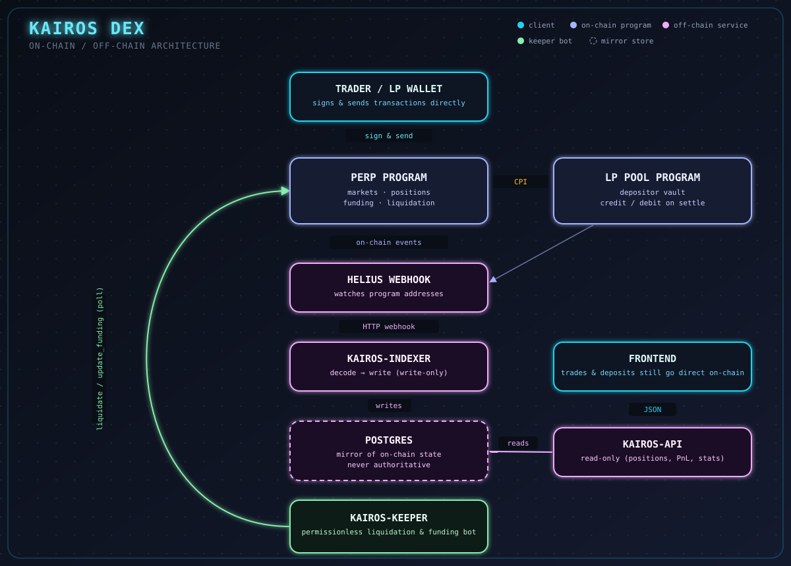

<div align="center">

# ⚡ Kairos DEX

**A perpetuals exchange on Solana.**
Traders take leveraged long/short positions against a shared LP vault, which acts as the counterparty — the house.

[](https://www.rust-lang.org/)
[](https://solana.com/)
[](https://www.anchor-lang.com/)
[](https://github.com/txtx/surfpool)
[](.docs/Deployments.md)

</div>

---

## Overview

Kairos is a synthetic perpetuals protocol: an on-chain `perp` program matches traders against a shared `liquidity-pool` vault instead of an order book. LP depositors are the passive counterparty — they earn fees and trader losses, but absorb trader profits, so the LP share price moves with aggregate trader PnL.

Off-chain, a write-only indexer mirrors on-chain events into Postgres, a read-only API serves that data to the frontend, and a permissionless keeper bot keeps liquidations and funding ticking.

## Architecture

<div align="center">

</div>

```
Trader / LP wallet
        │  (sign & send directly)
        ▼
Perp Program ──CPI──▶ LP Pool Program
        │
        │ on-chain events
        ▼
     Helius webhook
        │
        ▼
  kairos-indexer ──writes──▶ Postgres ◀──reads── kairos-api ──▶ Frontend
        ▲
        │
  kairos-keeper (liquidate / update_funding, polls the programs directly)
```

Trading, depositing, and liquidating all happen directly on-chain, signed by the caller's wallet — `kairos-api` / `kairos-indexer` / Postgres are a read mirror, never the source of truth.

## Components

| Component | Role |
|---|---|
| `programs/perp` | On-chain perp program — markets, positions, funding, liquidation |
| `programs/liquidity-pool` | On-chain LP vault — holds depositor funds, credited/debited by the perp program via CPI |
| `kairos-indexer` | Write-only service: listens to on-chain events (via Helius webhooks) and mirrors them into Postgres |
| `kairos-api` | Read-only service: serves indexed data (position history, PnL, pool stats) to the frontend |
| `kairos-keeper` | Permissionless bot: calls `liquidate` and `update_funding` so underwater positions get closed and funding keeps advancing |
| `kairos-db` | Postgres schema/migrations shared by the indexer and api |
| `kairos-rpc` | Shared Rust RPC client helpers |

<details>
<summary><strong>Component diagrams</strong></summary>

**Perp program**


**Indexer**


**Keeper**


**Trader flow**


**LP provider flow**


</details>

## Docs & diagrams

- [`.docs/`](.docs) — deployment notes, keeper spec (`perp-keeper-spec.md`), keeper architecture diagram (`perp-keeper.png`)
- [`.research/diagrams/kairos/`](.research/diagrams/kairos) — source `.excalidraw` files for the diagrams above (open/edit at [excalidraw.com](https://excalidraw.com))
- Per-component READMEs and `.docs/` folders under `programs/perp`, `programs/liquidity-pool`, `kairos-indexer`, `kairos-keeper`, `kairos-api` for deeper detail
- [`.research/`](.research) — background research (e.g. GMX v2 study)

## Running things

Each service has its own README with setup/run instructions. Typical order for local dev:

1. Build & deploy `programs/liquidity-pool`, then `programs/perp` (perp depends on the LP pool's program ID/accounts — see `programs/perp/README.md` troubleshooting section)
2. Start Postgres, run `kairos-indexer` (writer) and `kairos-api` (reader)
3. Run `kairos-keeper` against the deployed programs
